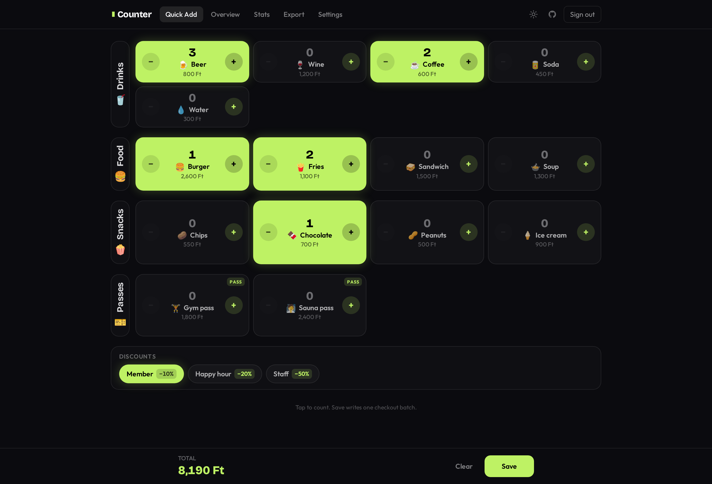
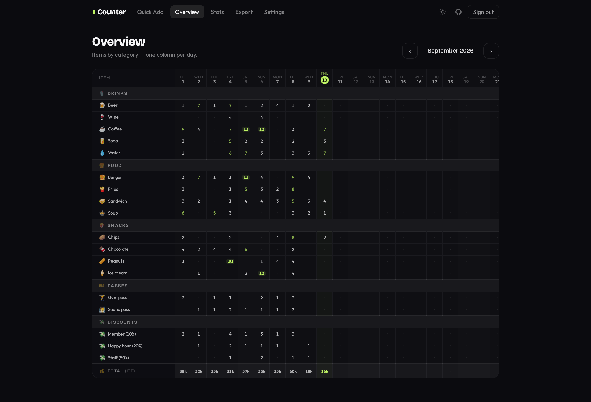
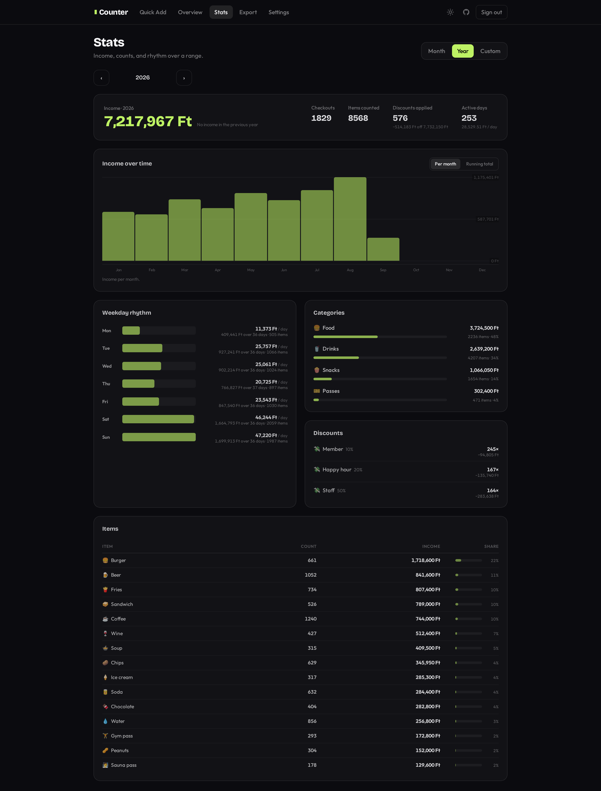

# Wallguard Counter

A small, auth-gated sold item **counter** web app, originally created for a
climbing gym handling entry tickets, passes, and rental items. Count items
(name, icon, price, category), save batches ("checkouts"), review a monthly
overview, read the numbers on a stats page, and export transactions to CSV.
Fully client-side — no backend.

## Screenshots

Counting a round on **Quick Add** — tap to count, discounts toggle at the
bottom, the bar tracks what the batch is worth:



The **Overview** grid — one column per day of the month, items grouped by
category, and a day-by-day money total along the bottom:



**Stats** over a month, a year, or a custom range — income and its change,
income over time, which weekdays carry the place, and per-category and per-item
breakdowns:



## Stack

Vite · React + TypeScript · React Router · Firebase (Auth + Firestore) ·
TanStack Query · Tailwind CSS v4 · Motion · Vitest + Testing Library.

All logic lives in the client plus Firestore Security Rules. Hosting is the
free Firebase Spark plan; access is restricted by an email allowlist stored in
Firestore and enforced by [`firestore.rules`](./firestore.rules).

## Local development

```bash
make install   # build the podman images
make start     # start the app + Firebase emulators
```

- App: http://localhost:5173
- Firebase Emulator UI: http://localhost:4000

To seed the local database from production:

```bash
make import-prod-db
```

Requires `FIREBASE_SERVICE_ACCOUNT` (production service account JSON) in your
environment.

Or fill the emulator with a year of generated activity — the data behind the
screenshots above, including the sign-in user `demo@wallguard.local` /
`password123`:

```bash
node scripts/seed-demo-data.mjs
```

### Without podman

```bash
cp .env.example .env      # fill in your Firebase web config, or set VITE_USE_EMULATORS=true
npm install
npm run emulators         # terminal 1 — needs a JRE installed
npm run dev               # terminal 2
```

## Scripts

| Command | Description |
| --- | --- |
| `npm run dev` | Vite dev server |
| `npm run build` | Type-check + production build to `dist/` |
| `npm run preview` | Preview the production build |
| `npm run lint` | ESLint |
| `npm run typecheck` | TypeScript, no emit |
| `npm run test` | Vitest (run once) |
| `npm run test:watch` | Vitest watch mode |
| `npm run test:emulators` | Run tests against the Firebase emulators |

Run a single test file: `npm run test -- src/lib/csv.test.ts`

Other scripts: `node scripts/seed-demo-data.mjs` (demo data for the emulator),
`node scripts/migrate.mjs` (migrations), `node scripts/emulator-roundtrip.mjs`
(smoke test against the emulators).

## Access control

Access is a **dynamic allowlist** in the Firestore `members` collection,
enforced by security rules on every read/write. Signed-in users not on the list
see an "Access pending" screen and can't touch any data.

- **Bootstrap owner:** one email is hardcoded in `firestore.rules`
  (`ownerEmail()`). Set it to your own email before deploying. The owner always
  has access and can never be locked out.
- **Managing members:** any existing member adds/removes people from **Settings
  → Members** — no redeploy needed. Both Google and email/password sign-in are
  supported; only sign-in, no self-registration.

The local emulator uses open dev rules (`firestore.dev.rules`).

## Firestore migrations

Forward-only numbered scripts live in `migrations/`. They run automatically in
CI before each deploy, and record applied versions in the `_migrations`
collection so they only run once.

To run locally against the emulator:

```bash
node scripts/migrate.mjs
```

## Deployment

GitHub Actions (`.github/workflows/deploy.yml`) runs on push to `main`:
install → lint → typecheck → test → migrations → build → deploy Hosting +
Firestore rules.

Required repository secrets:

| Secret | Value |
| --- | --- |
| `FIREBASE_SERVICE_ACCOUNT` | JSON key for a service account with deploy rights |
| `VITE_FIREBASE_API_KEY` | Web app config |
| `VITE_FIREBASE_AUTH_DOMAIN` | Web app config |
| `VITE_FIREBASE_PROJECT_ID` | Web app config |
| `VITE_FIREBASE_STORAGE_BUCKET` | Web app config |
| `VITE_FIREBASE_MESSAGING_SENDER_ID` | Web app config |
| `VITE_FIREBASE_APP_ID` | Web app config |

## License

Copyright © 2026 David Biró.

Licensed under the **European Union Public Licence v. 1.2** (EUPL-1.2). See
[`LICENSE`](./LICENSE) for the full text. The EUPL is a copyleft licence whose
share-alike obligation also covers making the software available over a network,
and it is compatible with the (A)GPL and other licences listed in its appendix.
